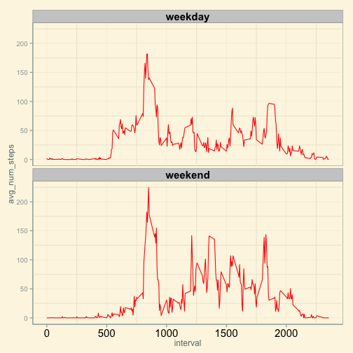

Reproducible research - Analysis of Activity monitoring data (assignment 1)
========================================================

In this document we will do analysis on the activity monitoring data provided in the assignment.Information about the variables in the data is below

* __steps__: Number of steps taking in a 5-minute interval (missing values are coded as NA)
* __date__: The date on which the measurement was taken in YYYY-MM-DD format
* __interval__: Identifier for the 5-minute interval in which measurement was taken

### Loading and preprocessing the data

Additional required processing is done in the later sections of the analysis.


```r
doc <- read.csv("activity.csv")
```


```r
library(ggplot2)
library(dplyr)
```

### What is mean total number of steps taken per day?

The code below calculated the sum of the steps per day and the plots a histogram.


```r
doc_1 <- doc %.%
group_by(date) %.%
summarise(newvar = sum(steps))
m <- ggplot(doc_1, aes(x=newvar))
m+geom_histogram(binwidth=1000,fill="green",colour="black")+xlab("number of steps taken each day") +ggtitle("Frequency of the number of steps per day")
```

 


The mean and median values of the total number of steps per day are:


```r
doc_1  %.% summarise(mean(newvar,na.rm=TRUE))
```

```
## Source: local data frame [1 x 1]
## 
##   mean(newvar, na.rm = TRUE)
## 1                      10766
```

```r
doc_1  %.% summarise(median(newvar,na.rm=TRUE))
```

```
## Source: local data frame [1 x 1]
## 
##   median(newvar, na.rm = TRUE)
## 1                        10765
```


### What is the average daily activity pattern?

The below plot is a time series plot of the 5-minute interval (x-axis) and the average number of steps taken, averaged across all days (y-axis) 


```r
avg <- doc %.% group_by(interval) %.% summarise(avg_num_steps = mean(steps,na.rm =TRUE))
m1 <- ggplot(avg, aes(x=interval,y=avg_num_steps))
m1+geom_line(colour="red") + xlab("5 minute time interval") +ylab("average steps for all days")+ ggtitle("Average number of steps for the time intervals")
```

 

```r
max_t <- avg %>%  arrange(desc(avg_num_steps)) %>% top_n(n=1)
```

```
## Selecting by avg_num_steps
```

```r
max_t 
```

```
## Source: local data frame [1 x 2]
## 
##   interval avg_num_steps
## 1      835         206.2
```

The time interval with maximum number of steps is 835 (In the morning).

### Imputing missing values


```r
t <- length(which(is.na(doc$steps)))
t
```

```
## [1] 2304
```

The total number of missing values in the dataset are 2304 .

I used the startegy to impute the missing values in steps field with the median of the steps for a interval for all the days.This does not change sample statistics drastically.The below code uses this logic and creates a new data set called doc_imputed and also creates a plot with the new data set


```r
doc_imputed <- doc %.% group_by(interval) %.% mutate(steps = ifelse(is.na(steps), median(steps, na.rm = T), steps))
avg_imputed <- doc_imputed %.%
group_by(date) %.%
summarise(num_steps = sum(steps))
me_imputed <- summarize(avg_imputed,mean(num_steps))
med_imputed <- summarize(avg_imputed,median(num_steps))
me_imputed
```

```
## Source: local data frame [1 x 1]
## 
##   mean(num_steps)
## 1            9504
```

```r
med_imputed
```

```
## Source: local data frame [1 x 1]
## 
##   median(num_steps)
## 1             10395
```

```r
m3 <- ggplot(avg_imputed, aes(x=num_steps))
m3+geom_histogram(binwidth=1000,fill="green",colour="black")+xlab("number of steps taken each day") +ggtitle("Frequency of the number of steps per day after impute")
```

 


The values are different compared to the values before imputing.Initially,the mean and median were almost equal.With the new values the mean is less than before compared to the median.With imputing the values the mean and median closely reflect the true population distribution of the data.

### Are there differences in activity patterns between weekdays and weekends?

The below code creates a new data set using the imputed data set with a field called 'week' which identifies if a date is weekday or weekend.Using the new data set I plotted the average number of steps for each time interval on weekday or weekend.


```r
require(lubridate)
library(ggthemes)
doc_imputed$week <- as.factor(ifelse(wday(doc_imputed$date) == 6 | wday(doc_imputed$date) == 7,"weekend","weekday"))
avg_final <- doc_imputed %.% group_by(interval,week) %.% summarise(avg_num_steps = mean(steps))
m4 <- ggplot(avg_final, aes(x=interval,y=avg_num_steps))
m4+geom_line(color = "red")+facet_wrap(~week,ncol=1)+theme_solarized()+theme(strip.text.x = element_text(size= 15,face = "bold",color = "black"),axis.text.x=element_text( size= 15,color = "black"))
```

 
